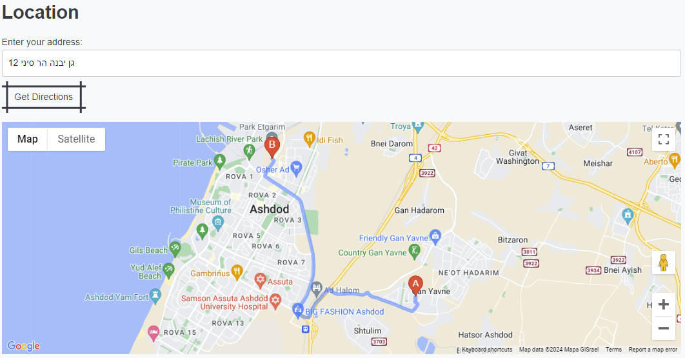
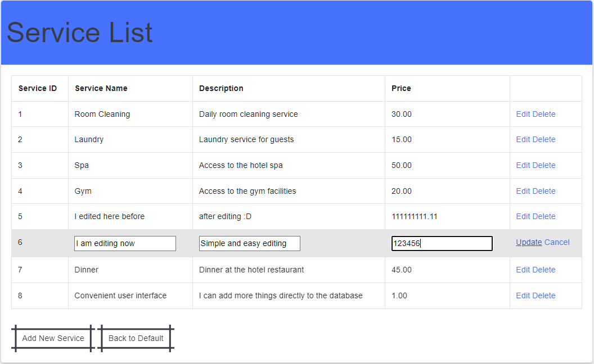

# 🏨 Hotel Management System

## 📋 Short Description

A comprehensive hotel management system designed to streamline hotel operations including room reservations, guest management, employee management, and service management. Built using ASP.NET Web Forms, C#, and SQL Server, this system integrates multiple APIs for enhanced functionality.

## 📑 Table of Contents

1. [Technologies Used](#-technologies-used)
2. [Prerequisites](#-prerequisites)
3. [Installation](#-installation)
4. [Usage](#-usage)
5. [Features](#-features)
6. [API Integration](#-api-integration)
7. [Screenshots And Examples](#-screenshots-and-examples)
8. [License](#-license)
9. [Contact](#-contact)

## 💻 Technologies Used

- ASP.NET Web Forms
- C#
- ASPX
- SQL Server
- HTML/CSS
- JavaScript
- jQuery
- Bootstrap

## 🛠 Prerequisites

- .NET Framework 4.8.1
- Visual Studio 2019 or later
- SQL Server 2017 or later

## 🚀 Installation

1. Create a `config.json` file in the root directory with the following content:

```
{
"emailService": {
  "serviceID": "ENTER YOUR EmailJS SERVICE KEY HERE",
  "templateID": "ENTER YOUR EmailJS TAMPLATE KEY HERE",
  "publicKey": "ENTER YOUR EmailJS PUBLIC KEY HERE",
  "privateKey": "ENTER YOUR EmailJS PRIVATE KEY HERE"
},
"weatherAPI": {
  "apiKey": "ENTER YOUR OpenWeatherMap API KEY HERE"
},
"googleMapsAPI": {
  "apiKey": "ENTER YOUR GOOGLE MAPS API KEY HERE"
}
}

```

2. Update web.config to include placeholders for sensitive information:

```
<connectionStrings>
  <add name="HotelManagementDB" connectionString="ENTER YOUR DATABASE CONNECTION STRING HERE" providerName="System.Data.SqlClient" />
</connectionStrings>

```

3. Be sure that you have installed the database and saved it in sql server in the database named: HotelManagementDB

## 📝 Usage

### API Integrations:

- **Google Maps API**: Displays the hotel's location and provides directions.
- **OpenWeatherMap API**: Shows current weather conditions in Ashdod.
- **EmailJS API**: Sends contact form submissions to the hotel's email.

## ✨ Features

- **User Authentication**: Secure login for hotel managers, team leaders, and employees.
- **Role-based Dashboard**: Different functionalities available based on user roles.
- **Room Management**: CRUD operations for room details.
- **Guest Management**: CRUD operations for guest information.
- **Reservation Management**: Manage room reservations and booking details.
- **Employee Management**: Manage employee details and roles.
- **Supplier Management**: Manage supplier information and contacts.
- **Service Management**: Manage additional services offered by the hotel.

## 🌐 API Integration

- **Google Maps API**: Helps guests find the best route to the hotel.
- **OpenWeatherMap API**: Provides real-time weather updates.
- **EmailJS AP**I: Sends contact form data directly to the hotel's email.

## 📸 Screenshots And Examples

### **Home Page**


### **Google Maps API**



### **Email.js**


### **My Email After Use EmailJS API**


### **Login Page**


### **Hotel Manager Dashboard**


### **Team Manager Dashboard**


### **User without access (For example: if a normal employee tries to enter the function of a manager by linking)**


### **Regular Employee Dashboard**


### **Add New DataBase**


### **Lists and Edit Lists**



## 📜 License

This project is licensed under the MIT License.

## 📬 Contact

- **Name**: Shay Marks
- **Email**: nrexhd@gmail.com
- **LinkedIn**: https://www.linkedin.com/in/shay-marks-920546260/
